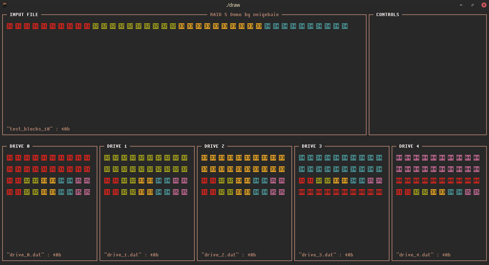

# RAID 5 Demo ✨

 

Simulation d'un système de fichier en RAID 5.



## Installation
### Téléchargement
[Lien de téléchargement](https://github.com/neigebaie/raid_five/releases/latest)
### Compilation
1. clone this repo
2. run make command
```
make
```

## Utilisation
Stockage d'un fichier :
```
 🐯   | ./raid_five -i example.txt
```

Reconstitution des blocs manquants :
```
 🐯   | ./raid_five -r
```

Toutes les options :
```
  -h        this help page
  -i file   input file
  -r        repair files
```

## Fonctionnalités à ajouter
- Gérer les fichiers plus petits qu'une stripe (< DRIVE_NB - 1 blocks).
- Gérer le mapping.